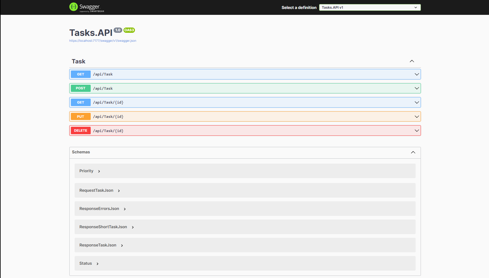

# Tasks Api

## A simple CRUD implementation with an ASP.NET Core Web Api about a task management service



## Table of Contents

- [Prerequisites](#prerequisites)
- [Installation](#installation)
- [Features](#features)
- [Usage](#usage)
- [Concepts](#Concepts)

## Prerequisites
- [.NET8](https://dotnet.microsoft.com/en-us/download/dotnet/8.0)

## Installation

1. Clone the repo:
    ```bash
    git clone https://github.com/LucasFdCosta/net8-tasks.git
    ```
2. Navigate into the project directory:
    ```bash
    cd net8-tasks
    ```
3. Run project:
    ```bash
    dotnet run --project Tasks.API
    ```
    OR
   If Visual Studio is installed, open the project solution "net8-tasks-api.sln" then press "F5" to debug

## Features

- Listing tasks
- Get task by id
- Add new task
- Edit existing task
- Remove existing task

## Usage

### Base URL
Replace `{{BASE_URL}}` with your actual local server address.

## Endpoints

### 1. Get All Tasks
**Description**: Retrieve a list of all tasks.

**Endpoint**:
```
GET /api/Task
```
**Headers**:
- `Accept: application/json`

**Response**:
- `200 OK`: Returns an array of tasks.

**Example**:
```bash
curl -X GET {{BASE_URL}}/api/Task -H "Accept: application/json"
```

---

### 2. Create a New Task
**Description**: Add a new task.

**Endpoint**:
```
POST /api/Task
```
**Headers**:
- `Content-Type: application/json`
- `Accept: application/json`

**Request Body**:
```json
{
  "name": "Sample Task",
  "description": "This is a sample task.",
  "priority": 1,
  "deadline": "2025-01-31T23:59:59Z",
  "status": 0
}
```
**Response**:
- `201 Created`: Returns the created task.
- `400 Bad Request`: Returns validation errors.

**Example**:
```bash
curl -X POST {{BASE_URL}}/api/Task \
     -H "Content-Type: application/json" \
     -H "Accept: application/json" \
     -d '{
           "name": "Sample Task",
           "description": "This is a sample task.",
           "priority": 1,
           "deadline": "2025-01-31T23:59:59Z",
           "status": 0
         }'
```

---

### 3. Get Task by ID
**Description**: Retrieve details of a specific task using its ID.

**Endpoint**:
```
GET /api/Task/{id}
```
**Path Parameters**:
- `id` (integer): The ID of the task.

**Headers**:
- `Accept: application/json`

**Response**:
- `200 OK`: Returns the task details.
- `404 Not Found`: Task with the given ID does not exist.

**Example**:
```bash
curl -X GET {{BASE_URL}}/api/Task/1 -H "Accept: application/json"
```

---

### 4. Update Task by ID
**Description**: Update details of an existing task using its ID.

**Endpoint**:
```
PUT /api/Task/{id}
```
**Path Parameters**:
- `id` (integer): The ID of the task.

**Headers**:
- `Content-Type: application/json`
- `Accept: application/json`

**Request Body**:
```json
{
  "name": "Updated Task Name",
  "description": "Updated task description.",
  "priority": 2,
  "deadline": "2025-02-15T23:59:59Z",
  "status": 1
}
```
**Response**:
- `204 No Content`: Task updated successfully.
- `400 Bad Request`: Returns validation errors.

**Example**:
```bash
curl -X PUT {{BASE_URL}}/api/Task/1 \
     -H "Content-Type: application/json" \
     -H "Accept: application/json" \
     -d '{
           "name": "Updated Task Name",
           "description": "Updated task description.",
           "priority": 2,
           "deadline": "2025-02-15T23:59:59Z",
           "status": 1
         }'
```

---

### 5. Delete Task by ID
**Description**: Remove a task using its ID.

**Endpoint**:
```
DELETE /api/Task/{id}
```
**Path Parameters**:
- `id` (integer): The ID of the task.

**Headers**:
- `Accept: application/json`

**Response**:
- `204 No Content`: Task deleted successfully.
- `404 Not Found`: Task with the given ID does not exist.

**Example**:
```bash
curl -X DELETE {{BASE_URL}}/api/Task/1 -H "Accept: application/json"
```

---

### Notes
- Make sure to replace placeholders like `{id}` or `{{BASE_URL}}` with actual values.
- Ensure the API server is running and accessible at the specified base URL.
- Use appropriate tools (e.g., Postman, curl) to test these endpoints.

## Concepts
- HTTP Requests
- ASP.NET Core Web Api Controllers and endpoints
- CRUD
- Single responsibility principle
- Separate application layers in projects
